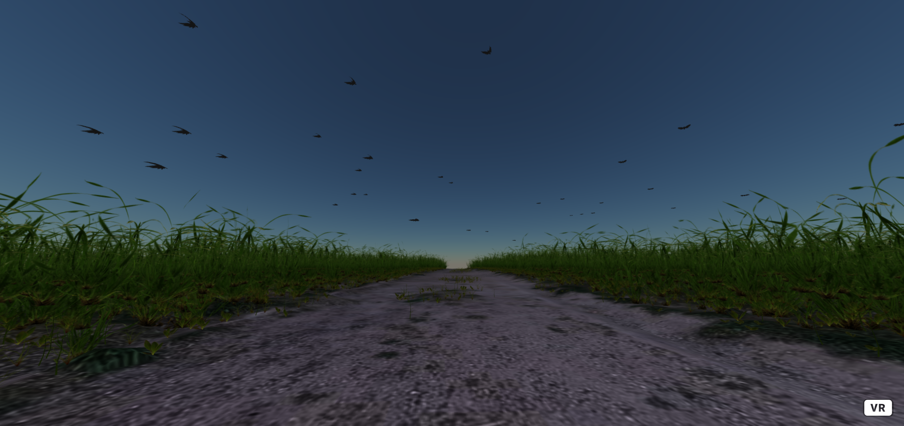

# Aframe-3D-Image-Replica

## Project Summary

For our project, we were required to build a 3D environment based off a 2D piece of media. Using this as a baseline, we decided to build a 3D image replica of Vincent Willem van Gogh's *Wheatfield with Crows* using A-Frame. An original image of the 2D drawing is attached below and an image of the 3D replica for the drawing it attached below that.

<h3 align="center">
    Original 2D Drawing: 
    
</h3>

<h3 align="center">
    3D Replica of Drawing: 
    
  

</h3>

## The Site
Currently, the 3D Replica is being hosted on GitHub Pages. If you would like to check out our project, please refer to the link below:
[https://rirah123.github.io/Aframe-3D-Image-Replica](https://rirah123.github.io/Aframe-3D-Image-Replica)
